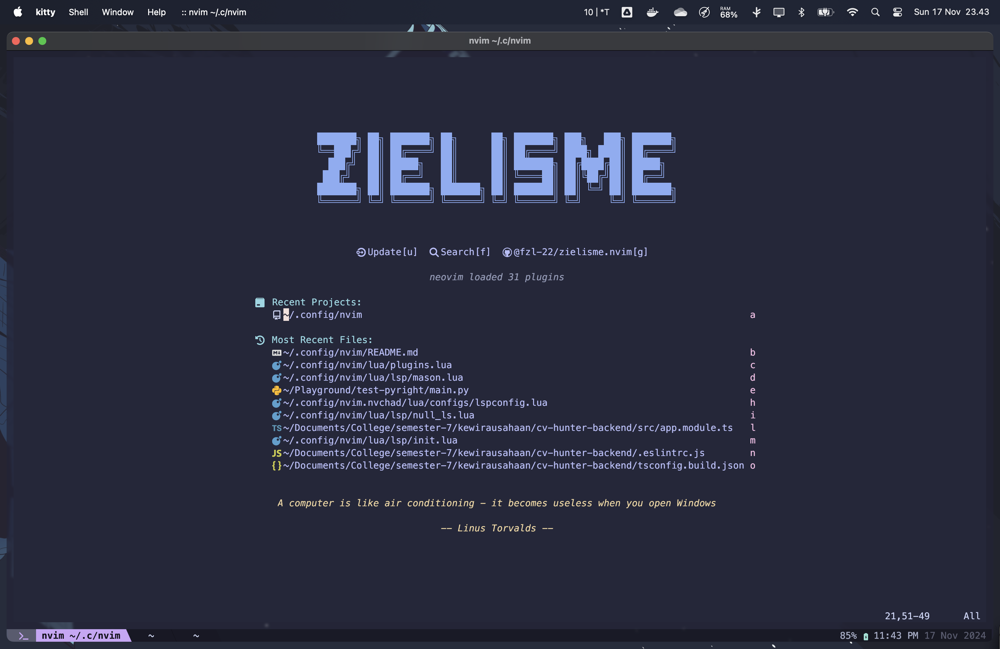
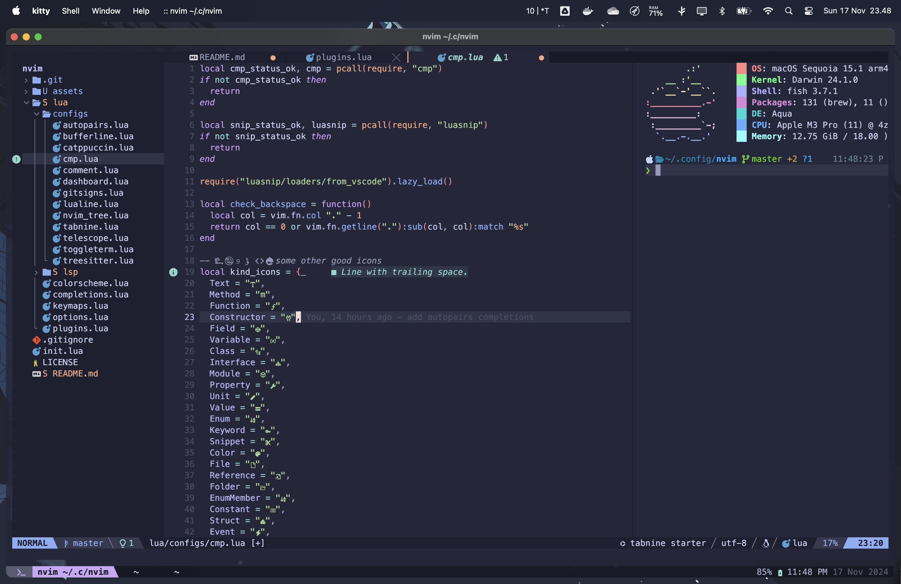

# zielisme.nvim

Here lies my Neovim setup :3.





## How to install

Before installing this Neovim configuration, you need to do this following steps.

### Install dependencies

You must first install these dependencies using your favorite package manager:

1. `nvim`, eg. `brew install neovim`, `sudo pacman -S neovim`, etc.
2. `rust-analyzer`(optional)
3. `black`, eg. `brew install black`
4. `vscode-langservers-extracted`, eg. `npm install -g vscode-langservers-extracted` (optional)
5. `marksman`, eg. `brew install marksman` (optional)
6. `typescript`, eg. `npm install -g typescript` (optional)
7. `typescript-language-server`, eg. `npm install -g typescript-language-server`(optional)

### Backup previous configuration

If you have previous Neovim configuration, it's recommended to back it up unless you don't want it to.

```bash
mv ~/.config/nvim ~/.config/nvim.old
```

### Install Neovim configuration

To install this configuration, you need to clone this repository to `$HOME/.config/nvim` (on Linux or Mac).

```bash
git clone git@github.com:fzl-22/zielisme.nvim.git "$HOME/.config/nvim" && nvim
```

## Attribution

This configuration is adapted from [LunarVim/Neovim-from-scratch](https://github.com/LunarVim/Neovim-from-scratch) and draws significant inspiration from [NvChad/NvChad](https://github.com/NvChad/NvChad)
